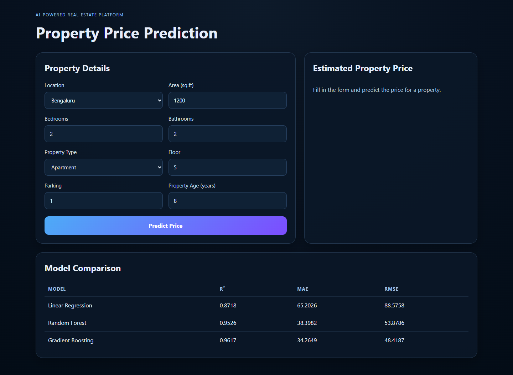
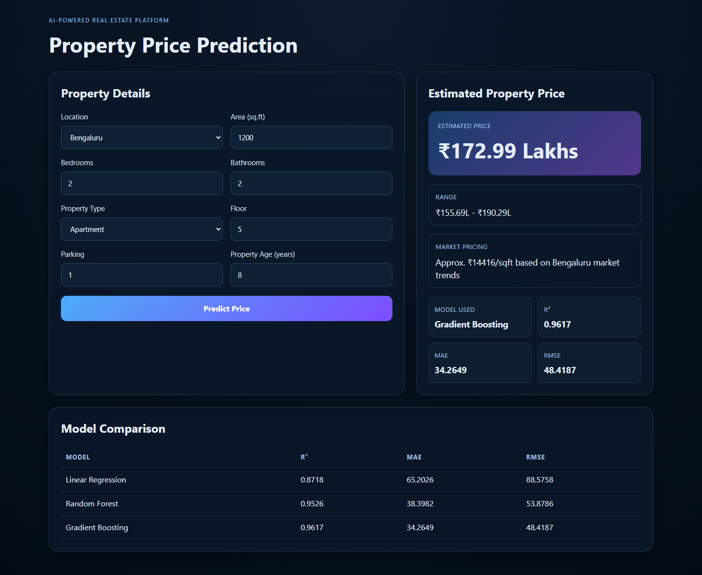

# AI-Powered Real Estate Price Prediction Platform

<div align="center">


</div>

A full-stack machine learning web application that estimates residential property prices from location, area, property type, bedrooms, bathrooms, floor, parking, and property age. The platform combines a React dashboard with a FastAPI prediction service and trained scikit-learn regression models.

## Preview

### Property Input Form



### Prediction Result



## Key Features

- Predicts property prices in INR lakhs from practical real-estate inputs.
- Supports multiple Indian city markets including Bengaluru, Mysuru, Hyderabad, Chennai, Pune, Mumbai, and Delhi.
- Trains and compares Linear Regression, Random Forest, and Gradient Boosting models.
- Returns an estimated price, confidence-style price range, selected model, and model metrics.
- Provides a clean React + Vite user interface backed by a FastAPI REST API.
- Includes reproducible local model training through `backend/train_model.py`.

## Tech Stack

| Layer | Tools |
| --- | --- |
| Frontend | React 18, Vite 5, CSS |
| Backend | FastAPI, Uvicorn, Pydantic |
| Machine Learning | scikit-learn, Pandas, NumPy, Joblib |
| Language/runtime | Python 3.11, Node.js |

## Project Structure

```text
.
+-- backend/
|   +-- app/
|   |   +-- main.py          # FastAPI routes and prediction logic
|   |   +-- schemas.py       # Request and response models
|   +-- requirements.txt
|   +-- test_market_pricing.py
|   +-- train_model.py       # Synthetic market dataset + model training
+-- frontend/
|   +-- src/
|   |   +-- App.jsx
|   |   +-- index.css
|   |   +-- main.jsx
|   +-- package.json
|   +-- vite.config.js
+-- screenshots/
+-- README.md
```

## Model Performance

After training with the included market-aware synthetic dataset, the best model is Gradient Boosting.

| Model | R2 | MAE | RMSE |
| --- | ---: | ---: | ---: |
| Linear Regression | 0.8718 | 65.2026 | 88.5758 |
| Random Forest | 0.9526 | 38.3982 | 53.8786 |
| Gradient Boosting | 0.9617 | 34.2649 | 48.4187 |

## Local Setup

### Prerequisites

- Python 3.11+
- Node.js 18+
- npm

### 1. Clone the repository

```bash
git clone https://github.com/beingvicky/AI-Powered-Real-Estate-Price-Prediction-Platform.git
cd AI-Powered-Real-Estate-Price-Prediction-Platform
```

### 2. Set up and run the backend

```bash
cd backend
python -m venv .venv
.\.venv\Scripts\activate
pip install -r requirements.txt
python train_model.py
python -m uvicorn app.main:app --host 127.0.0.1 --port 8000
```

For running backend tests, install the development dependencies:

```bash
pip install -r requirements-dev.txt
python -m pytest
```

The API will be available at:

```text
http://127.0.0.1:8000
```

### 3. Set up and run the frontend

Open a second terminal:

```bash
cd frontend
npm install
npm run dev -- --host 127.0.0.1 --port 5173
```

To point the frontend at a different backend URL, copy `frontend/.env.example` to `frontend/.env` and update `VITE_API_BASE_URL`.

Open the application:

```text
http://127.0.0.1:5173
```

## API Reference

### Health Check

```http
GET /health
```

### Model Metadata

```http
GET /models
```

### Predict Property Price

```http
POST /predict
```

Example request:

```json
{
  "location": "Bengaluru",
  "area": 1200,
  "bedrooms": 2,
  "bathrooms": 2,
  "property_type": "Apartment",
  "floor": 5,
  "parking": 1,
  "age": 8
}
```

Example response:

```json
{
  "estimated_price_lakhs": 172.99,
  "price_range_lakhs": {
    "min_lakhs": 155.69,
    "max_lakhs": 190.29
  },
  "model_used": "Gradient Boosting",
  "metrics": {
    "r2": 0.9617,
    "mae": 34.2649,
    "rmse": 48.4187
  }
}
```

## Notes

- Model artifacts are generated locally by `python train_model.py` and are intentionally ignored by Git.
- The pricing dataset is synthetic and market-aware, so predictions are suitable for portfolio/demo use rather than financial decision-making.
- The frontend expects the backend to run on `http://localhost:8000` or `http://127.0.0.1:8000`.

## License

This project is licensed under the [MIT License](LICENSE).

## Author

Developed by [@beingvicky](https://github.com/beingvicky).
